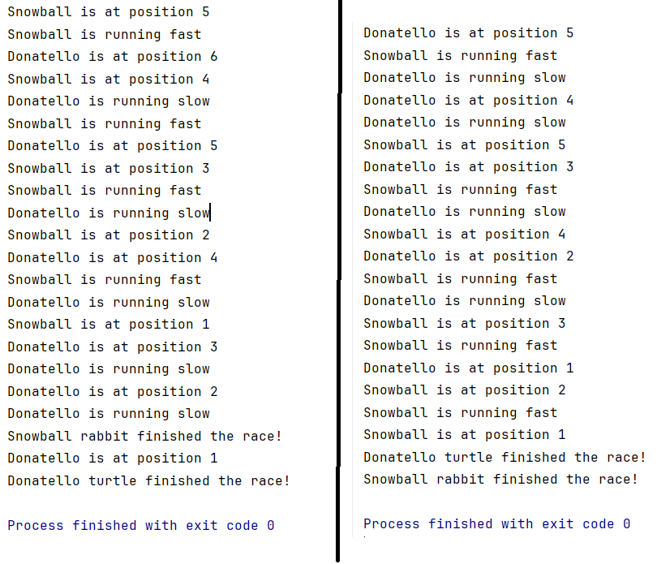

# Programação Concorrente em Java
O primeiro questionamento foi sobre a questão do determinismo na aplicação, nesse sentido, executando o código multiplicas vezes é possível perceber que o resultado pode tanto ser a vitória do coelho Snowball ou da tartaruga Donatello. O comportamento alterando a cada execução pode ser visto na imagem abaixo:



Para entender esse comportamento, torna-se necessário primeiro entender o que são Threads, se olharmos no Google, veremos que há uma série de definições formais.


Mas, em síntese, pode-se dizer que Threads são dois programas funcionando ao mesmo tempo, entretanto, os objetos e variáveis são compartilhados, ou seja, perceba a diferença nessas duas situações:
1) Programas diferentes: Atleta A corre a Maratona de Floripa e Atleta B corre a maratona de Santa Maria. Ambos podem ficar em primeiro lugar.
2) Threads (Concorrência): Atleta A corre a Maratona de Floripa e o Atleta B também corre a mesma maratona. Quando um ficar em primeiro lugar, o outro já não pode obter essa posição.
Um dos problemas da progração concorrente é que essas atletas não possuem conhecimento que existem outros competidores, ou seja, um Thread não tem conhecimento que está dividindo um objeto com outro, o que causa colisões, para isso, é necessário ter um controle para manejar isso.

Perfeito, agora temos uma ideia do que está acontecendo no código, mas, ainda é necessário compreender o motivo dos resultados serem modificados conforme cada execução. Em síntese, o que acontece é o seguinte. 
Primeiro criamos nossa classe Rabbit e um objeto r dessa classe, essa classe Rabbit já extende a classe Thread, então não é necessário criar uma thread separadamente.
```java
class Rabbit extends Thread
Rabbit r = new Rabbit("Snowball");
r.start();
}
```
O que esse método start faz é chamar o método start0 e a JVM irá criar um thread real. Aqui temos a mudança de estado da Thread, a Thread muda de estado e passa de New para Runnable // Running. Em mais baixo nível, o que o start está fazendo é alocando memória, registrando essa thread no escalonador do s.o, já entraremos nesse tópico.
```java
public void start() {
        synchronized (this) {
            // zero status corresponds to state "NEW".
            if (holder.threadStatus != 0)
                throw new IllegalThreadStateException();
            start0();
        }
    }
```
A criação da segunda Thread, da tartaruga, foi feita de maneira diferente. Em conclusão após algumas pesquisas, verifiquei que não há uma maneira certa ou errada, mas depende de como cada programa está estruturado. A principal desvantagem de utilizar a primeira maneira é que não podemos tornar a nossa classe uma subclasse de outra.
```java
class Turtle implements Runnable
Thread t = new Thread(new Turtle("Donatello"));
```

Show, agora que temos as duas threads, fica fácil de entender o determinismo, ou a falta dele. O que acontece é que ambas as Threads entram em uma fila, controlada pelo escalonador, que decide, podemos pensar que de maneira aleatória, qual thread será executada, ou receberá tempo de execução. Nesse sentido, percebe-se que como é imprevisível, não há como saber o resultado antes de executar o código.

A  próxima tarefa era adicionar uma nova classe, foi bastante simples, apenas copiamos o código da classe abaixo:
```java
class Golden_Lion_Tamarin implements Runnable{
    private String name;

    public Golden_Lion_Tamarin(String name){
        this.name = name;
    }

    private void runLikeTamarin() {
        System.out.println(name + " is running medium");
    }

    public void run(){
        System.out.println(name + " Golden_Lion_Tamarin is at the start of the race!");
        for (int pos = 10; pos > 0; pos--) {
            runLikeTamarin();
            System.out.println(name + " is at position " + pos);
        }
        System.out.println(name + "  Golden Lion Tamarin finished the race!");
    }
}
```
e na Thread race
```java
Thread glt = new Thread(new Golden_Lion_Tamarin("Lilith"));
glt.start();
```

O segundo exercício era de refatoração, para criar uma super classe AnimalRunner e derivar as três classes de animais dela. Esse exercício também foi bem fácil, pois os códigos já estavam prontos e apenas tivemos que mover para a superclasse e criar os métodos de polimorfismo para cada animal. 
```java
Class AnimalRunner extends Thread{
    protected String name;
    protected String animal;
    public AnimalRunner(String name, String animal){
        this.name = name;
        this.animal = animal;
    }

    protected void RunAnimal(String name){
        System.out.println(name + "correndo");
    }

    public void run(){
        for (int pos = 10; pos > 0; pos--) {
            RunAnimal(name);
            System.out.println(name + " is at position " + pos);
        }
        System.out.println(name + " " + animal + " finished the race!");
    }
}
```

```java
class Rabbit extends AnimalRunner {
    public Rabbit(String name, String animal) {
        super(name, animal);
    }
    @Override
    public void RunAnimal(String name) {
        System.out.println(name + " is running fast");
    }
}
```

